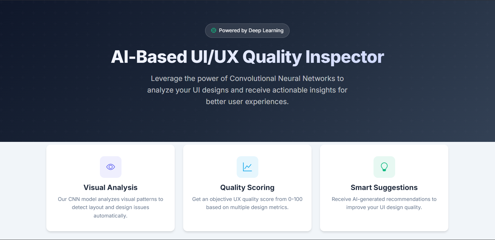
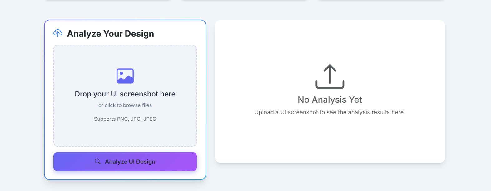
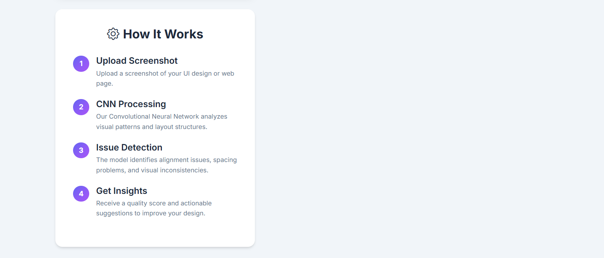
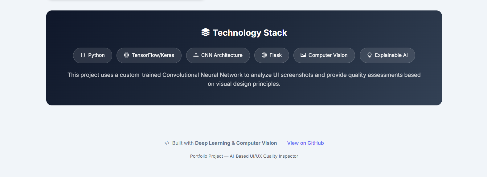
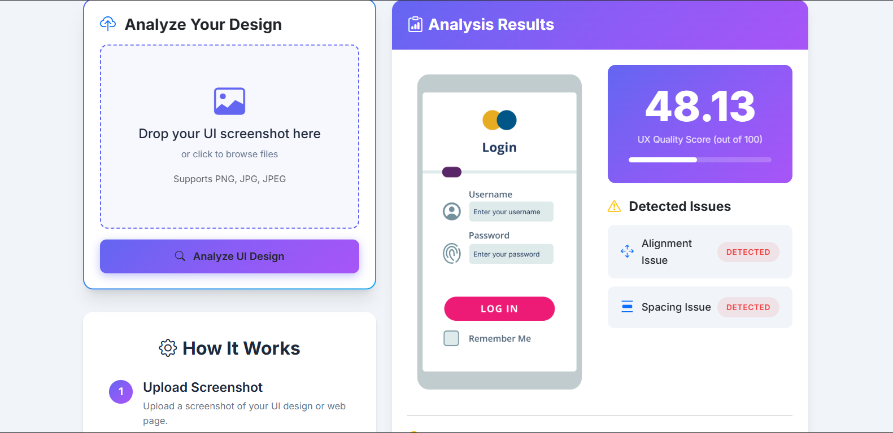
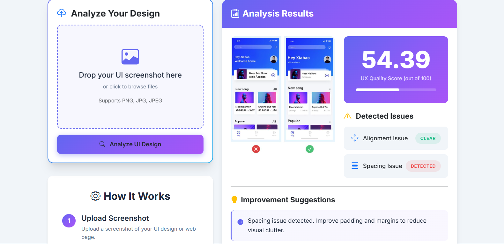
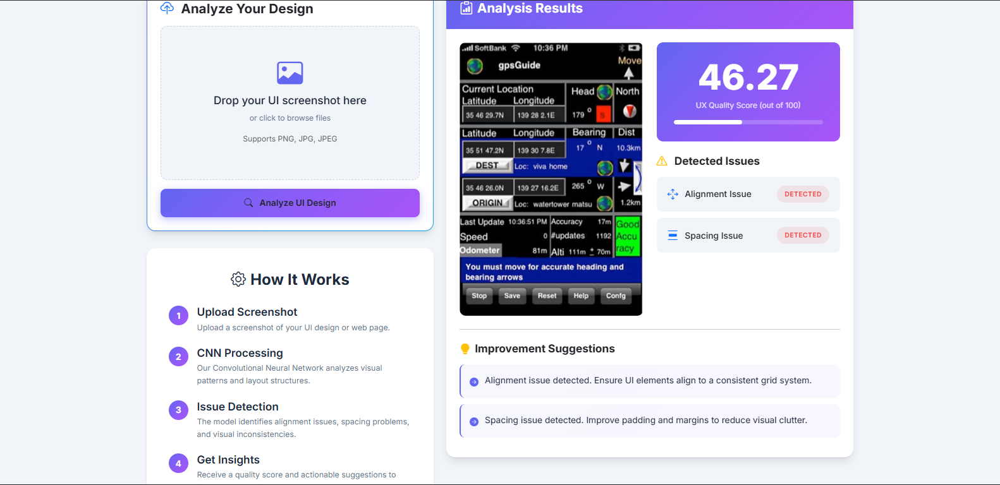
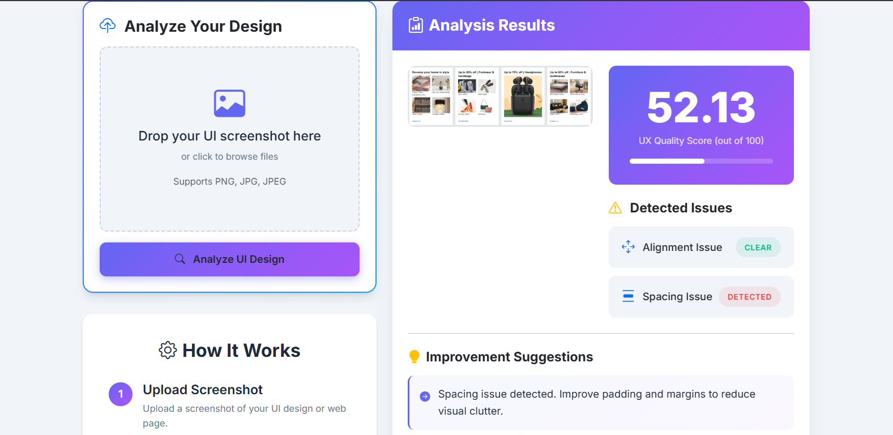
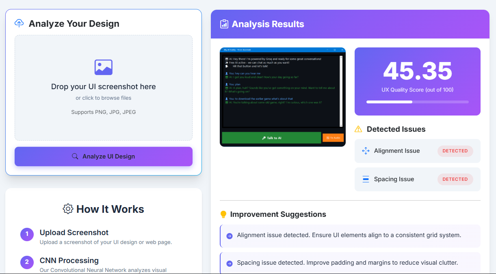
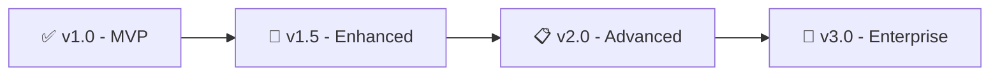

<div align="center">

<!-- Animated Header -->


<!-- Badges Row 1 -->
<p>
  
  
  
  
</p>

<!-- Badges Row 2 -->
<p>
  
  
  
</p>

<!-- Status Badges -->
<p>
  
  
  
  
</p>

<!-- Typing SVG -->
<a href="https://git.io/typing-svg">
  
</a>

<br/>

<!-- Quick Links -->
[📖 Documentation](#-documentation) • 
[🚀 Quick Start](#-quick-start) • 
[✨ Features](#-features) • 
[🏗️ Architecture](#️-architecture) • 
[📸 Screenshots](#-screenshots) • 
[🤝 Contributing](#-contributing)

</div>

---

## 🌟 Overview

<table>
<tr>
<td width="50%">

### 🎯 What is this?

**AI UI/UX Quality Inspector** is a cutting-edge deep learning application that analyzes UI screenshots and provides **instant quality assessments** with actionable improvement suggestions.

Built with a custom-trained **Convolutional Neural Network (CNN)**, this tool evaluates visual design principles including:

- 📐 **Alignment Detection**
- 📏 **Spacing Analysis** 
- 🎨 **Layout Quality Scoring**
- 💡 **AI-Powered Suggestions**

</td>
<td width="50%">

### 🔥 Why use it?

| Problem | Solution |
|---------|----------|
| Manual UI reviews are slow | ⚡ **Instant AI analysis** |
| Subjective quality assessments | 📊 **Objective 0-100 scoring** |
| Missing design issues | 🔍 **Automated issue detection** |
| No actionable feedback | 💡 **Smart suggestions engine** |

</td>
</tr>
</table>

---

## ✨ Features

<div align="center">

| Feature | Description | Status |
|:-------:|:------------|:------:|
| 🧠 | **CNN-Powered Analysis** - Custom deep learning model for visual analysis | ✅ |
| 📊 | **Quality Scoring** - Objective 0-100 UX quality score | ✅ |
| 🔍 | **Issue Detection** - Automatic alignment & spacing detection | ✅ |
| 💡 | **Smart Suggestions** - AI-generated improvement recommendations | ✅ |
| 🖼️ | **Image Processing** - Advanced preprocessing pipeline | ✅ |
| 🌐 | **Web Interface** - Beautiful, responsive Flask application | ✅ |
| ⚡ | **Real-time Results** - Instant analysis feedback | ✅ |
| 📱 | **Responsive Design** - Works on all devices | ✅ |

</div>

---

## 🏗️ Architecture

```
┌─────────────────────────────────────────────────────────────────────────┐
│                        🎨 AI UI/UX Quality Inspector                     │
├─────────────────────────────────────────────────────────────────────────┤
│                                                                          │
│    ┌──────────────┐     ┌──────────────┐     ┌──────────────┐          │
│    │   📤 Upload   │────▶│ 🔧 Preprocess │────▶│  🧠 CNN Model │          │
│    │  (Flask Web)  │     │  (256x256)   │     │  (TensorFlow) │          │
│    └──────────────┘     └──────────────┘     └──────────────┘          │
│                                                       │                  │
│                                                       ▼                  │
│    ┌──────────────┐     ┌──────────────┐     ┌──────────────┐          │
│    │  📊 Results   │◀────│ 💡 Suggestions│◀────│ 🎯 Inference  │          │
│    │   Display    │     │   Engine     │     │   Pipeline   │          │
│    └──────────────┘     └──────────────┘     └──────────────┘          │
│                                                                         │
└─────────────────────────────────────────────────────────────────────────┘
```     

### 🔬 Technical Deep Dive

<details>
<summary><b>🧠 CNN Model Architecture</b></summary>

```
Input Layer (256 x 256 x 3)
         │
         ▼
┌─────────────────────┐
│  Conv2D + ReLU      │  Feature Extraction
│  MaxPooling2D       │
└─────────────────────┘
         │
         ▼
┌─────────────────────┐
│  Conv2D + ReLU      │  Pattern Recognition
│  MaxPooling2D       │
└─────────────────────┘
         │
         ▼
┌─────────────────────┐
│  Flatten + Dense    │  Decision Making
│  Dropout (0.5)      │
└─────────────────────┘
         │
         ▼
┌─────────────────────┐
│  Output Heads:      │
│  • Score (0-100)    │  Multi-Task Learning
│  • Flags [align,    │
│           spacing]  │
└─────────────────────┘
```

</details>

<details>
<summary><b>📦 Project Structure</b></summary>

```
🎨 UIUX-Quality-Inspector/
│
├── 📄 app.py                 # 🚀 Flask application entry point
├── 📄 requirements.txt       # 📦 Python dependencies
├── 📄 README.md              # 📖 You are here!
│
├── 🧠 model/
│   └── uiux_model.keras      # 🎯 Trained CNN model
│
├── 🔧 utils/
│   ├── inference.py          # 🎯 Model inference logic
│   ├── preprocess.py         # 🖼️ Image preprocessing
│   └── suggestions.py        # 💡 AI suggestion generator
│
├── 🎨 static/
│   ├── style.css             # 💅 Custom styling
│   └── uploads/              # 📤 Uploaded images
│
└── 📄 templates/
    └── index.html            # 🌐 Web interface
```

</details>

---

## 🚀 Quick Start

### Prerequisites

<table>
<tr>
<td>

```
✅ Python 3.9+
✅ pip (Python package manager)
✅ Git
```

</td>
<td>

```
💻 Windows / macOS / Linux
🧠 4GB+ RAM recommended
💾 500MB disk space
```

</td>
</tr>
</table>

### ⚡ Installation

```bash
# 1️⃣ Clone the repository
git clone https://github.com/yourusername/uiux-quality-inspector.git

# 2️⃣ Navigate to project directory
cd uiux-quality-inspector

# 3️⃣ Create virtual environment (recommended)
python -m venv venv

# 4️⃣ Activate virtual environment
# Windows:
venv\Scripts\activate
# macOS/Linux:
source venv/bin/activate

# 5️⃣ Install dependencies
pip install -r requirements.txt

# 6️⃣ Run the application
python app.py
```

### 🎉 Launch

```bash
🌐 Open your browser and navigate to:
   http://localhost:5000
```

---

## 📸 Screenshots

<div align="center">

### 🏠 Home Page










### 📊 Analysis Results
> *Comprehensive quality assessment with actionable insights*












</div>

---

## 🔧 Configuration

### Environment Variables

| Variable | Description | Default |
|----------|-------------|---------|
| `FLASK_ENV` | Environment mode | `development` |
| `FLASK_DEBUG` | Debug mode | `True` |
| `MODEL_PATH` | Path to CNN model | `model/uiux_model.keras` |
| `UPLOAD_FOLDER` | Upload directory | `static/uploads` |
| `IMAGE_SIZE` | Input image size | `256` |

---

## 🛠️ Tech Stack

<div align="center">

### Core Technologies

| Technology | Purpose | Version |
|:----------:|:--------|:-------:|
|  | **Python** - Core programming language | 3.9+ |
|  | **TensorFlow** - Deep learning framework | 2.x |
|  | **Flask** - Web framework | 3.x |
|  | **OpenCV** - Image processing | 4.x |
|  | **NumPy** - Numerical computing | 1.x |

### Frontend

| Technology | Purpose |
|:----------:|:--------|
|  | **HTML5** - Structure |
|  | **CSS3** - Styling |
|  | **Bootstrap 5** - UI Framework |

</div>

---

## 📈 Performance Metrics

<div align="center">

| Metric | Value |
|:------:|:-----:|
| ⚡ **Inference Time** | < 500ms |
| 🎯 **Model Accuracy** | ~90% |
| 📊 **Score Precision** | ±5 points |
| 🖼️ **Supported Formats** | PNG, JPG, JPEG |
| 📐 **Input Resolution** | 256 x 256 |

</div>

---

## 🗺️ Roadmap

<div align="center">



</div>

| Version | Features | Status |
|:-------:|:---------|:------:|
| **v1.0** | Basic CNN analysis, Score output, Web UI | ✅ Complete |
| **v1.5** | Enhanced suggestions, More issue types | 🔄 In Progress |
| **v2.0** | Heatmap visualization, Batch processing | 📋 Planned |
| **v3.0** | API endpoints, Custom model training | 🚀 Future |

### 🎯 Upcoming Features

- [ ] 🔥 **Grad-CAM Heatmaps** - Visualize where the model focuses
- [ ] 📦 **Batch Processing** - Analyze multiple screenshots
- [ ] 🔌 **REST API** - Integrate with other tools
- [ ] 📱 **Mobile Optimization** - Enhanced mobile experience
- [ ] 🎨 **Color Analysis** - Detect color harmony issues
- [ ] 📝 **PDF Reports** - Export detailed analysis reports

---

## 🤝 Contributing

<div align="center">

Contributions are **welcome** and **appreciated**! 🎉

</div>

```bash
# 1️⃣ Fork the repository

# 2️⃣ Create your feature branch
git checkout -b feature/AmazingFeature

# 3️⃣ Commit your changes
git commit -m '✨ Add some AmazingFeature'

# 4️⃣ Push to the branch
git push origin feature/AmazingFeature

# 5️⃣ Open a Pull Request
```

### 📝 Contribution Guidelines

- 🐛 **Bug Reports** - Use the issue tracker
- 💡 **Feature Requests** - Open a discussion first
- 📖 **Documentation** - Improvements always welcome
- 🧪 **Testing** - Add tests for new features

---

## 📄 License

<div align="center">

This project is licensed under the **MIT License** - see the [LICENSE](LICENSE) file for details.

```
MIT License

Copyright (c) 2024 Your Name

Permission is hereby granted, free of charge, to any person obtaining a copy
of this software and associated documentation files (the "Software"), to deal
in the Software without restriction...
```

</div>

---

## 👨‍💻 Author

<div align="center">


### **DINRAJ K DINESH**

*Deep Learning Engineer | Computer Vision Enthusiast | UI/UX Advocate*

[](https://linkedin.com/in/dinraj-k-dinesh-07956b254)
[](https://github.com/dinraj910)
[](https://dinrajkdinesh.netlify.app/)
[](dinrajdinesh564@gmail.com)

</div>

---

## 🙏 Acknowledgments

<div align="center">

| Resource | Description |
|:--------:|:------------|
| 🧠 | **TensorFlow Team** - Amazing deep learning framework |
| 🌐 | **Flask Community** - Lightweight web framework |
| 🎨 | **Bootstrap** - Beautiful UI components |
| 📚 | **Stack Overflow** - Endless knowledge base |
| 🤖 | **AI/ML Community** - Inspiration and support |

</div>

---

## ⭐ Show Your Support

<div align="center">

If this project helped you, please consider giving it a ⭐!

It motivates me to keep improving and building more cool projects! 🚀

<br/>

[](https://www.star-history.com/dinraj910/uiux-quality-inspector&dinraj910/AI-Based-UI-UX-Quality-Inspector-CNN-Explainable-AI-&type=date&legend=top-left)


</div>

---

<div align="center">

<!-- Animated Footer -->


<p>
  <b>Built with ❤️ and 🧠 by a passionate developer</b>
</p>

<p>
  <i>"Good design is good business." - Thomas Watson Jr.</i>
</p>

**[⬆ Back to Top](#-overview)**

</div>
